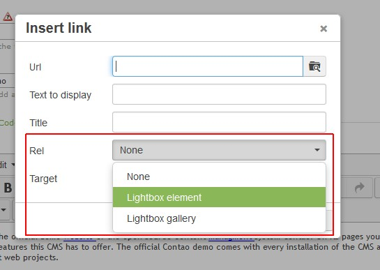

Contao Extension: TinyMceLinkLightbox
=====================================

Special TinyMCE plugin to set the rel attribute in the link dialog for opening links in a lightbox.

Installation
------------

Install the extension via composer: [cliffparnitzky/tiny-mce-link-lightbox](https://packagist.org/packages/cliffparnitzky/tiny-mce-link-lightbox).

If you prefer to install it manually, download the latest release here: https://github.com/cliffparnitzky/TinyMceLinkLightbox/releases

Tracker
-------

https://github.com/cliffparnitzky/TinyMceLinkLightbox/issues

Compatibility
-------------

- min. Contao version: >= 3.3.0
- max. Contao version: <  3.6.0

Dependency
----------

- To load this plugin and add it to the configuration the extension [[TinyMcePluginLoader]](https://github.com/cliffparnitzky/TinyMcePluginLoader) has to be installed.

Screenshot
----------

Additional information
----------------------

### Special notes

There is nothing special to pay attention to.

### Information in the wiki

#### Create a new ...

* [Creating a new plugin](https://github.com/cliffparnitzky/TinyMcePluginLoader/wiki/Creating-a-new-plugin)
* [Creating a new bundle](https://github.com/cliffparnitzky/TinyMcePluginLoader/wiki/Creating-a-new-bundle)
* [Creating a new setup](https://github.com/cliffparnitzky/TinyMcePluginLoader/wiki/Creating-a-new-setup)

#### Installation hints
* [Install manually](https://github.com/cliffparnitzky/TinyMcePluginLoader/wiki/Install-manually)

#### Bug report hints

* [Report a bug](https://github.com/cliffparnitzky/TinyMcePluginLoader/wiki/Report-a-bug)